class: center, middle

# Assembling a custom mechanical keyboard

---

# What is a mechanical keyboard

- You have come this far and still dont know what it is?
- Clack clack
- Cherry MX
- Razer, Corsair (no)
- Ducky, Coolermaster (yes)

---

# Why would you build your own?

- Cheaper?
- Customizability
- Better quality
- For funzies

---

# What makes a keyboard?

- Switches
- PCB / Handwire with a Teensy board
- Stabalisers / Ortholinear keyboard
- Case / Sandwich plates
- Mounting Plate / PCB mounted switches
- Keycaps (SA, DSA, OEM, Cherry)
- Cable / Wireless
- Firmware (and you though we won't be coding)

---

# Ortholinear Keyboard with no stabalisers

.center[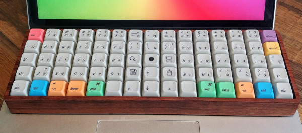]

---

# Switches

- Cherry
- Gateron :-) (Zealios)
- Khail
- Greetech
- Romer :-(
- Razer :-(
- Topre = rubber domes ;-)

---

# PCB

- GeekHack 60 -> GH60 Satan
- DZ60 -> USB Type-C
- Teensy
- qmk_firmware

---

# Handwire

.center[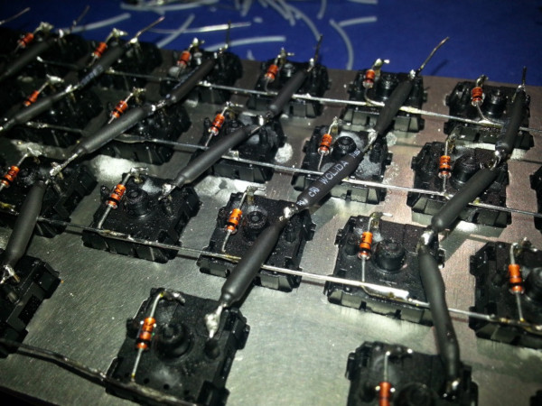]

---

# Stabs

- Generics
- Cherry
- GMK screw in
- Costar
- Ortholinear?
- Plate vs PCB

---

# Cherry Stabs

.center[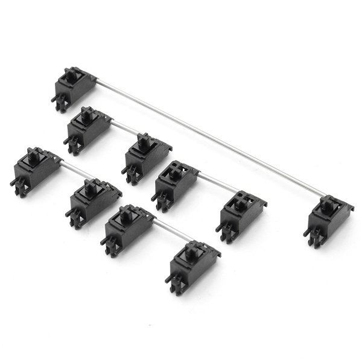]

---

# Plate vs PCB mount

.center[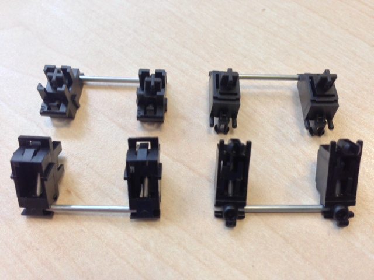]

---

# Costar Stabs

.center[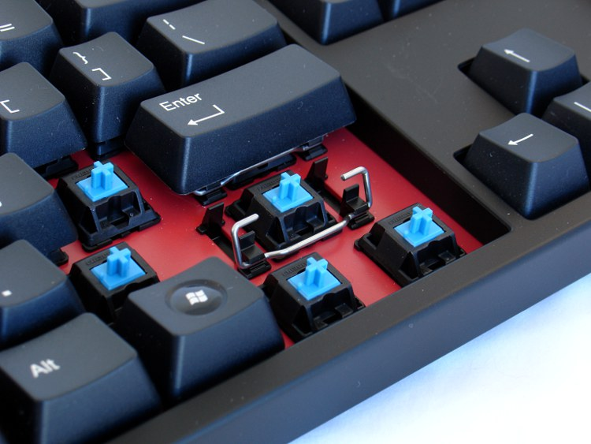]

---

# Case

- Tofu
- Aluminium
- Wood
- Acrylic
- Sandwich

---

# LJD61UP

.center[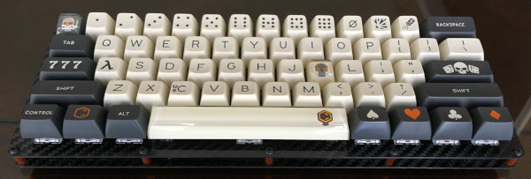]

---

# Mounting Plate

- Layout (ANSI, ISO)
- Sound
- Feeling
- Check with stabs

---

# Keycaps

- Cherry compatible
- Profile
  - DSA
  - SA
  - Cherry
  - OEM
  
---

# Keycap profiles

.center[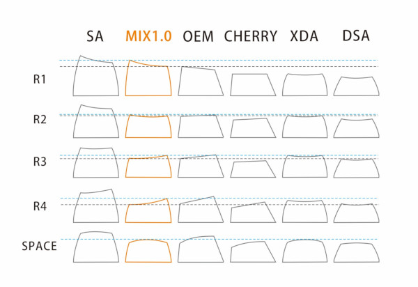]

---

# Parts

.center[]

---

# Preparing Stabalisers

.center[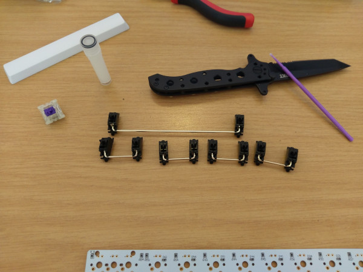]

---

# Corner switches

.center[]

---

# First solder EVER!!!

.center[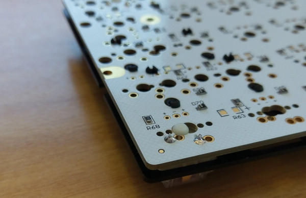]

---

# Switch push

.center[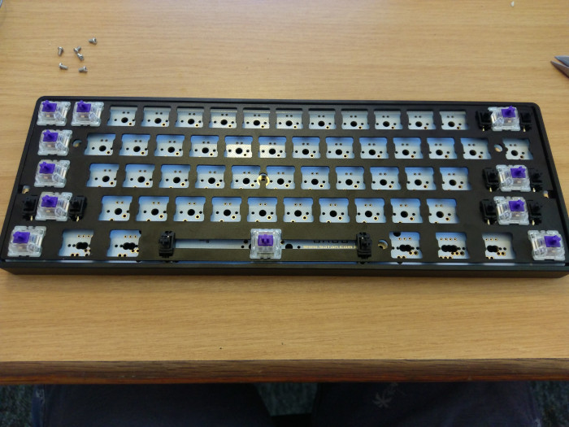]

---

# My daily

.center[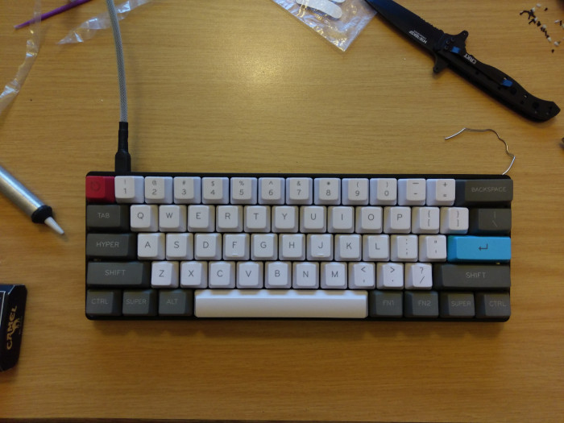]

---

# We got a dud

.center[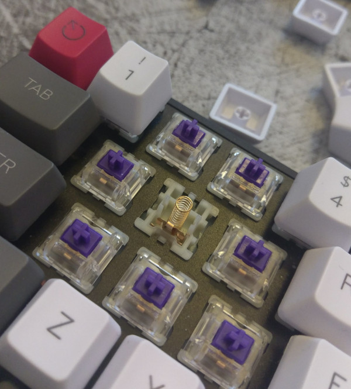]

---

# Stems and switch top remover \#nudes ;)

.center[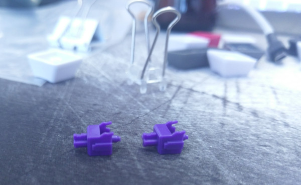]

---

# Firmware

- QMK Firmware
- Input Clubs funky firmware

---

# Shops

- [KBD Fans](https://kbdfans.cn) sometimes down but they have the DZ60 and many other cool things
- [1up keyboards](https://www.1upkeyboards.com/) have never bought from them but a trusted shop in the community
- Amazon is actually a really good resource as well if you know what you are looking for.

---

# Resources

- [Stabaliser Mod](https://www.youtube.com/watch?v=cD5Zj-ZgMLA)
- [Assembling stabalisers](https://www.youtube.com/watch?v=D21Ocg9kVsU)
- [Skiwithpete](https://www.youtube.com/user/skiwithpete) owner of 1upkeyboards does keyboard building live streams of products on his shop (also has a discord you can join to ask questions)
- [TaeKeyboards](https://www.youtube.com/channel/UCllGwtW6scxAjM28fIgEozg) good keyboard review channel and some guides
- [/r/MechanicalKeyboards](https://www.reddit.com/r/MechanicalKeyboards/) they have a very nice wiki with a lot of information on a lot of keyboards and guides on modding with links to many things (most probably the holy grail of knowledge and keyboard "porn")
- \#mechanicalkeyboard on slack :)
- [QMK](https://qmk.fm/)

---
